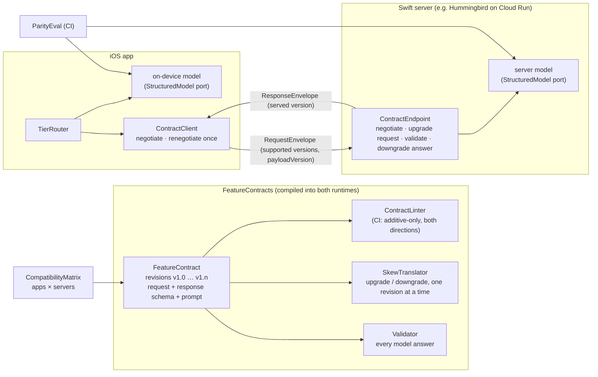

# FeatureContracts

**One typed contract for an AI feature, compiled into the iOS app *and* the Swift server, plus the machinery that keeps both safe while three app versions and two server deploys are live at the same time.**

[](https://github.com/rajatslakhina/feature-contract-kit/actions/workflows/ci.yml)
  

**Demo app:** [feature-contract-kit-demo-app](https://github.com/rajatslakhina/feature-contract-kit-demo-app), a separate Xcode project that consumes this package as a remote dependency. It requires version `1.0.1` up to the next major version. No `Package.resolved` is committed, so a fresh clone resolves the newest 1.x. The demo repo has real CI-Simulator screenshots of all four console tabs.

---

## The problem

At the start of October 2026 Google announced Google Cloud client libraries for Swift, built on SwiftNIO and async/await ([coverage](https://xenospectrum.com/en/google-cloud-swift-server-sdk/), [The Register](https://www.theregister.com/software/2026/10/02/google-hearts-apples-swift-so-much-its-pumping-out-server-side-support/5300921)). "Swift end to end" is now a realistic choice for an iOS team's backend-for-frontend, and the obvious first move is a shared package: put the `@Generable` output schema, the prompt and the DTOs in one place and import it from both sides.

That move has a catch. Sharing the source does not mean the two sides run the same version of it.

- **The app is a fleet.** The receipt extractor in this repo's demo has App 3.8 (6% of installs), 4.0 (31%) and 4.1 (63%) live at once, each compiled against a different revision of the contract.
- **The server is a rollout.** For the length of a deploy, some requests hit `api-2026.09` and some hit `api-2026.10`. In that window, a just-released app is *newer* than the server it is talking to.
- **Two models answer.** The on-device model handles what it can. A heavier server model handles devices without Apple Intelligence, prompts that do not fit the on-device context, and on-device answers that fail validation. The UI is written against one schema, so it has to behave the same whichever model answered.

A shared package gives you a single definition. It does not give you a rule for how that definition is allowed to change. This package supplies the rule and enforces it in CI, and it ships the runtime that uses it.

## Why this matters for a lead

The tricky decisions here are about ownership and change, not code:

- **Who may change the schema, and how?** Within a major version, only additive changes, enforced by a linter that runs as a unit test. A major bump is a fleet-wide event that needs a retirement plan, not a pull request.
- **Which skew directions do you support?** Both. Textbook API variance (requests may only widen, responses may only narrow) assumes one side is always newer. In a mobile fleet that assumption fails for the whole deploy window, so this linter applies the *same* rules to both halves.
- **Where does user data go?** Escalating from the on-device model to a server model moves the user's receipt off the phone. That is declared once per contract (`DataResidency`) and enforced by the router. It is not decided at each call site.
- **When are two models "the same"?** When a parity eval says so. Golden inputs run through both tiers with the same rendered prompt, and the build fails if the structured outputs diverge beyond a threshold. An eval with zero cases is *inconclusive*, never a pass.

## Architecture



| Type | Responsibility |
|---|---|
| `FeatureContract`, `ContractRevision`, `ObjectSchema`, `FieldType` | The contract: versioned request/response schemas with constraints as part of the type, enum *fallback chains*, defaults, a `DataResidency`, and a prompt with a stable FNV-1a fingerprint. |
| `ContractLinter` | Compares adjacent revisions and reports `breaking` / `lossy` / `note` findings for both halves of the contract. Run it as a test and a breaking schema change fails the build. |
| `SkewTranslator` | Moves a value between revisions of the same major, one step at a time, in either direction. It fills defaults, drops unknown fields and follows enum fallbacks (`hostel → lodging → travel`). It never clamps. |
| `Validator` | Checks types, ranges, lengths, counts, enum membership, unexpected fields and nesting depth. It runs on every model answer before anything reaches the caller. |
| `ContractEndpoint` | The server half. It is stateless and transport-agnostic (`handle(data:)` is the whole HTTP surface). It negotiates, upgrades the request, generates at its newest revision of that major, validates, and downgrades the answer to the app's revision. |
| `ContractClient` | The app half. It negotiates per call, resends once at an older revision when the server is behind, then upgrades the answer back to its own revision. It checks request IDs. |
| `TierRouter` | Tries on-device first, then the server, with a context-budget check, validation of the on-device answer, residency enforcement, cancellation, and a full decision trace. |
| `ParityEval` | Same golden inputs, both tiers, per-field rules (`exact`, `tolerance`, `normalizedText`, `ignore`), and a pass / fail / *inconclusive* verdict in basis points. |
| `CompatibilityMatrix` | Every (app build × server build) cell: `native`, `serverAhead`, `clientAhead`, `degraded` (served, but the downgrading side crosses a declared-lossy widening, so some values fail with a typed error), `noSharedVersion`, or `unsafe` (naming the lint finding responsible). It also gives the share of installs each deploy would break, and the share it would serve on a lossy path. |
| `ContractConsole` | Turns a scenario into a snapshot of all of the above. The SwiftUI module (`FeatureContractsUI`) only renders it, so the console's logic is tested on Linux too. |

## Design decisions, trade-offs, rejected alternatives

**1. The same evolution rules for requests and responses.**
*Decision:* a field added within a major must be optional or have a default. Ranges and lengths may only widen. Enum cases may only be added, and only with a fallback chain into the previous revision. All of this applies to both halves.
*Why:* when the app is ahead, it downgrades its own request and upgrades the server's answer; when the server is ahead, the reverse. Every schema has to survive both directions.
*Rejected:* classic contravariant-request / covariant-response rules. They are correct only if the server always deploys first, and no mobile team can promise that for every minute of a rollout.
*Trade-off:* this is stricter than it needs to be for teams that really do deploy server-first, and you cannot add a *required* answer field without a default inside a major.

**2. Widening is allowed but reported as `lossy`, and the translator never clamps.**
v1.2 widens `total` from 0…100 000 to 0…1 000 000. A v1.0 app cannot read a 450 000 total. Translating it throws `notExpressible("total")`, and the server answers with a distinct `notExpressible` status (not `modelFailed`: nothing is broken, the app is too old for this answer). It does not send a number the old app would reject, or worse, a clamped 100 000 that passes validation and is wrong. The compatibility matrix shows these pairs as `degraded`, counting only the side that actually downgrades: an app that is ahead loses on requests, a server that is ahead loses on answers.
*Rejected:* silent clamping or truncation. A value that validates but is wrong is worse than a visible failure.

**3. Walk one revision at a time.**
The linter checks adjacent pairs, and the translator walks adjacent pairs, so the guarantee holds over any distance (v1.0 ↔ v1.2) without an N² compatibility table. Enum fallbacks compose the same way: `hostel` (1.2) → `lodging` (1.1) → `travel` (1.0).

**4. Stateless client and server: negotiation travels with each request.**
The envelope carries `supported` and `payloadVersion`, and the server answers `renegotiate` at most once. *Rejected:* a cached handshake. It goes stale exactly when skew exists, because a load balancer moves the app between an old and a new deploy mid-rollout. *Trade-off:* a newer app pays one extra round trip per call while it is ahead of the server.

**5. `TierRouter` is a struct, not an actor.**
It has no mutable state, so two concurrent routes cannot interleave through shared fields, and there is no reentrancy to reason about across the two model `await`s. The trace is built locally and returned.

**6. Never retry the same tier with the same prompt.**
An on-device answer that fails validation escalates once, to the server, and only when the contract's residency allows it (`escalateOnInvalidOutput` can turn even that off). A model that produced an invalid answer for a prompt is not evidence it will produce a valid one for the same prompt, and the user pays the latency either way.

**7. Ports instead of SDKs: `StructuredModel` and `ContractTransport`.**
The package ships no Foundation Models adapter and no Vertex AI / Gemini client. That keeps the package the *app* links free of server dependencies, and it means the router, endpoint and parity eval run in tests on Linux. A Hummingbird route around `ContractEndpoint.handle(data:)` takes three lines (shown in its doc comment).
*Build-vs-buy note:* launch coverage of Google's Swift libraries describes a Cloud Run guide that calls Gemini from a Hummingbird service, but I did not confirm which package that guide uses or how stable it is. So a Gemini adapter belongs behind this port, not in this package.
*Trade-off:* you write two thin adapters yourself, and neither is tested here.

**8. The parity eval can say "inconclusive".**
Zero golden cases, or every field marked `.ignore`, is never reported as a pass. A schema violation from either tier fails the eval even at a 0% threshold, because a violation is a contract bug, not a disagreement between models.

**What it deliberately does not do:** Apple-side token counting (`TokenEstimate` is a 4-bytes-per-token heuristic, used for routing only), retries with backoff, request signing, or persistence of a version-retirement plan. Each of those belongs in the app's networking layer or the server's deploy tooling.

## Usage

```swift
.package(url: "https://github.com/rajatslakhina/feature-contract-kit.git", from: "1.0.1")
```

```swift
import FeatureContracts

// In the shared package: the contract, with every revision still shipped.
let receipts = FeatureContract(id: "expense.extract", residency: .serverAllowed, revisions: [v10, v11, v12])

// In CI (a unit test): the evolution gate.
XCTAssertTrue(ContractLinter.lint(receipts).isMergeable)

// On the server: hand this to your HTTP framework.
let endpoint = ContractEndpoint(contracts: [receipts], retiredBelow: ["expense.extract": ContractVersion(1, 1)],
                                model: GeminiAdapter())          // yours: a StructuredModel

// In the app: on-device first, server second, everything validated.
let router = TierRouter(contract: receipts, onDevice: FoundationModelsAdapter(),     // yours: a StructuredModel
                        remote: ContractClient(contract: receipts, transport: URLSessionTransport()), // yours: a ContractTransport
                        policy: RoutingPolicy(onDeviceContextBudget: 3_000))
let outcome = await router.route(.object(["text": .string(ocrText)]), requestID: UUID().uuidString)
```

## Verification

- **Local (author, Linux, Swift 6.1.2):** clean `swift build --build-tests -Xswiftc -warnings-as-errors` (0 warnings) and `swift test`: **61 tests, 0 failures**. The SwiftUI module compiles to nothing on Linux (`#if canImport(SwiftUI)`), so it is only checked by the macOS CI job.
- **Mutation check:** 38 hand-made source mutations (removing a lint rule, clamping instead of throwing, skipping validation of on-device output, ignoring residency, treating an empty parity eval as a pass, picking the lowest shared version, dropping the body-size guard, and so on). The suite kills all 38, and all 38 were re-run against the final code. Four of them first survived (one only came to light in the independent review); each was fixed with a new or stronger test, or by deleting a redundant guard.
- **CI** ([Actions](https://github.com/rajatslakhina/feature-contract-kit/actions)): two jobs on every push to `main`.
  - **Linux** (`swift:6.0` container): clean `swift build --build-tests -Xswiftc -warnings-as-errors`, then `swift test`.
  - **`macos-15`**: the same build including the SwiftUI module, `swift test`, then `xcodebuild` for `generic/platform=iOS Simulator` with warnings as errors.
  - Every run after the first has passed both jobs. The run for the `v1.0.1` tree reports **61 tests, 0 failures** on macOS as well.
  - The very first run failed: on macOS, `swift test` died with `signal 10`. A test built a 5,000-deep hostile value inside an async test, and releasing it overflowed a 512 KB cooperative-thread stack. The test now uses 300 levels, still far past the 32-level guard. That failed run is left in the history.
- **Simulator:** this package has no app target. The demo app was built, installed, launched and screenshotted on a CI iOS Simulator. It was **not** run on the author's Mac. See the demo repo for exactly what ran where.
- **Independent review:** an Opus reviewer graded the code before the push and returned eight failures. All eight were fixed before `v1.0.0`:
  - an unbounded `description` recursion on hostile model output;
  - defaults not applied on the same-version path, which made the prompt depend on skew;
  - a matrix that hid lossy pairs;
  - scheme arguments copied from another project;
  - three tests that could pass against broken code;
  - a client that masked the server's error;
  - two unsourced claims;
  - polish items.
- **Second independent review** (a fresh Opus reviewer, on `v1.0.0`): eight more findings. Seven were fixed in **`v1.0.1`**:
  - `TierRouter` now validates answers from *any* `RemoteContractAnswering` conformer, instead of trusting that `ContractClient` did;
  - `renderPrompt` is a single pass, so user text containing `{{locale}}` reaches the model verbatim;
  - `degraded` counts only widenings, because a removed field never makes a call fail;
  - the linter now notes a changed default;
  - the all-pairs skew test compares each full answer against an independently written expectation;
  - the demo's screenshot script requires a numeric PID before it says "alive";
  - the demo README's screenshot and version-pin claims were corrected.
  - The eighth finding, a mutation reported as never run, was already resolved: it had been re-run and killed against the current code.
- **Third and final independent review** (fresh Opus): eight findings. All eight were fixed in `v1.0.1`:
  - `RemoteAnswer` had no public initializer, so the "substitutable" remote port could not be implemented outside the module. A non-`@testable` test now implements it.
  - A test for validating against the app's revision rather than the served one.
  - Innermost-placeholder handling in `renderPrompt` (`{{{text}}}`, `{{a {{text}}`).
  - A cancellation check at the router's entry.
  - The demo screenshots split one scenario per shot, so each fits on screen.
  - Stale counts and wording.
  - **These round-3 fixes were not independently re-reviewed:** the task caps review at three rounds. They are covered by the tests and mutations above.

## License

MIT. See [LICENSE](LICENSE).
